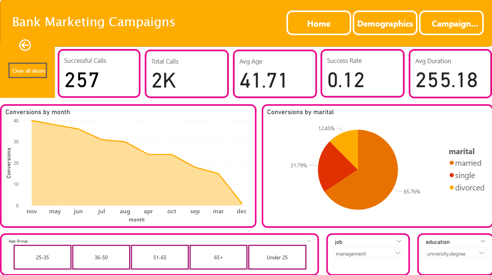

# 📊 Bank Marketing Campaign Analysis (Power BI)

This project analyzes the Bank Marketing Dataset using **Power BI** to discover insights about customer subscriptions.

## 🚀 Key Insights
- Highest Performing Contact Type: Cellular outperforms Telephone
- Average Success Rate per Campaign
- Longest Call Duration among Subscribers
- Best Month for Campaigns

## 📈 Dashboards

## 🛠️ Tech Used
- Power BI
- DAX
- Data Visualization
